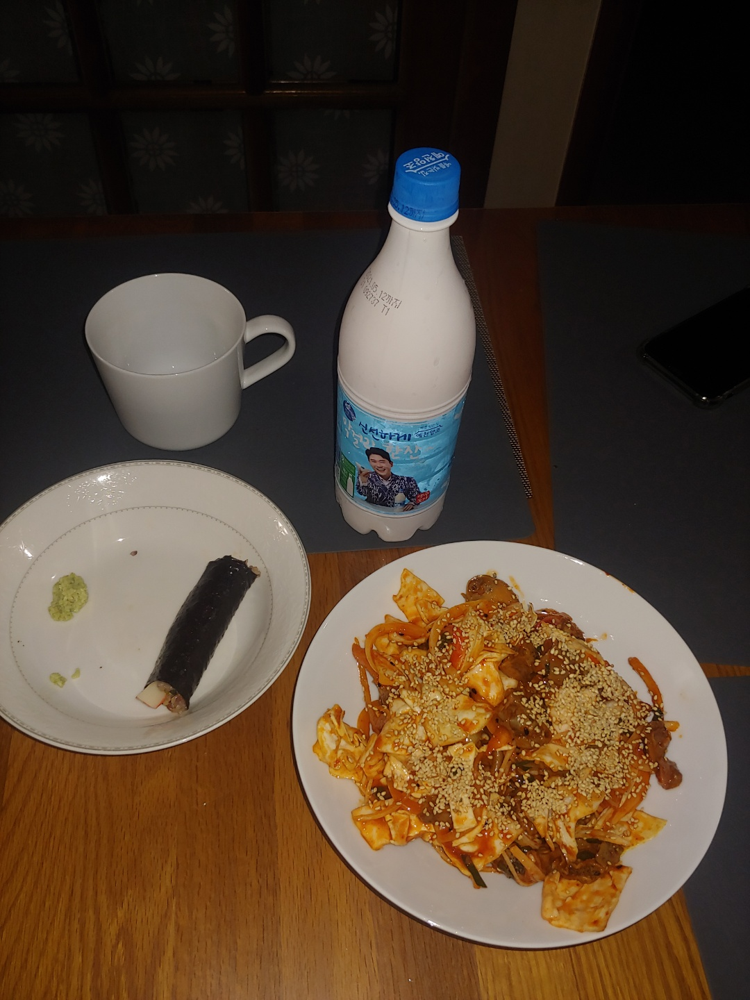
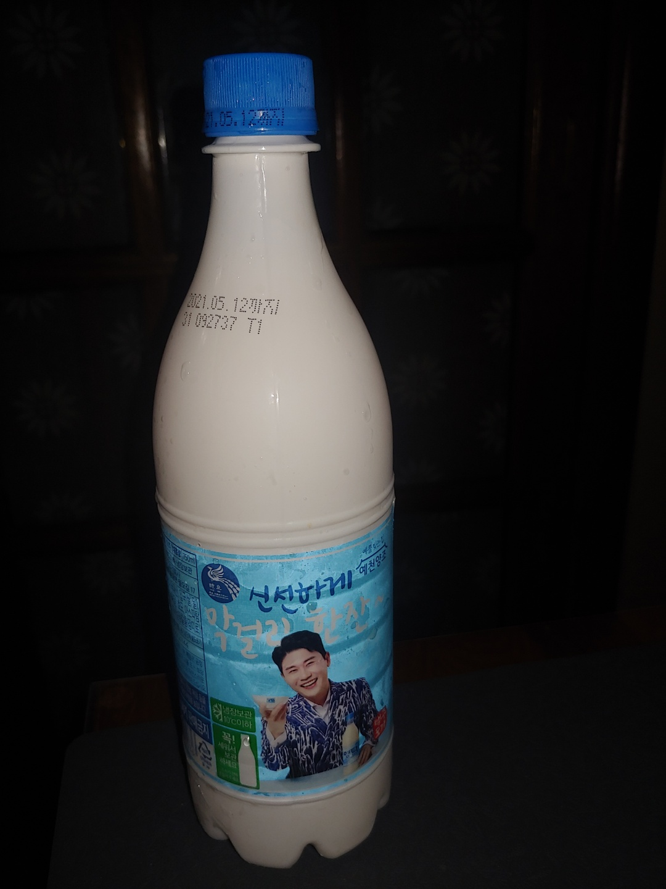
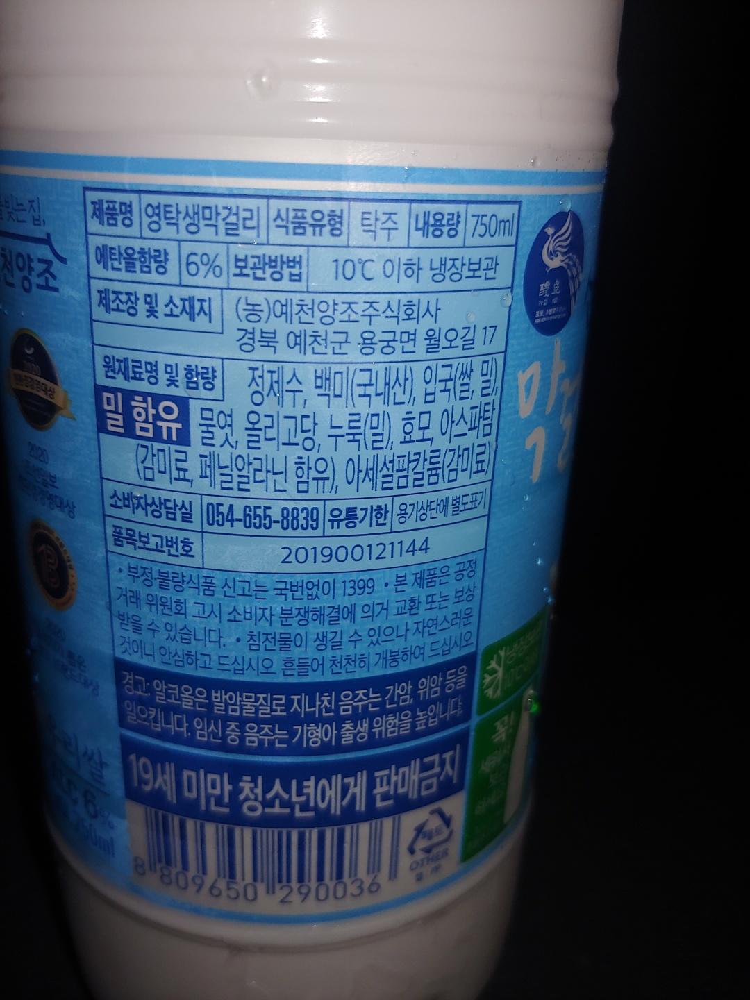

* content
{:toc}

🍺 전체 설명 : 영탁 막걸리  
 - 용량 :750 ml  
 - 가격 : 1,750월  
 - 제조사 : (주)우리술  

📆 취식일자 : 2021년 4월 20일 ( 화요일 )  
🚀️ 취식장소 : My Sweet Home  
👪동석자 : 아내  

🍽 차림상  

👍 이미지

📓 상세 설명

첫맛
- 깨끗한 맛( 탁하지 않음 )
- 단맛도 적당, 끝에서 약간 쓴맛
- 이게 막걸리구나 하는 생각이 들었음

1잔
- 쓰네, 사카린 맛이 난다고함 ( 아내 )
- 여전히 맛있네

2잔
- 얼음 맛 밖에 안나네 ( 아내 )
- 술먹은후 아내가 나보고 이기주의자라고 했음
- 다시 태어나면 나 같은 사람 안만난다.( 땡큐 )
  - 쓰레기 같은 인간( 주말에 골프 축구 다하는 ) 이라함 ㅜㅜ;
  - 안보면 불쌍하고 보면 웬수라는 말 첨가

마지막잔 후
- 역시 장수막걸리가 최고야 ( 아내 )
- 맛있는데 왜그래? ( 나 )
